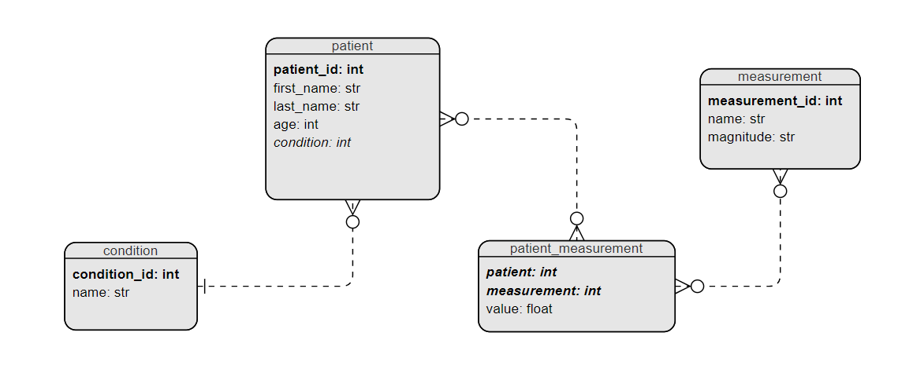

## About

This project is an package to handle with all database stuff needed on painkiller.

## DER

Following you can see the Diagram that represents the database.

### Conditionts

- Healthy
- High blood pressure
- Diabetes
- Heart disease
- Asthma
- Obesity
- Arthritis
- Alzheimer's
- Depression

### [Mesasurements](https://askthescientists.com/measuring-health/)

- Blood Pressure
- Heart Rate
- Breathing Rate
- Body Temperature
- Oxygen Saturation
- Blood Glucose
- Sleep
- Activity